# The other scrubber — BentoBox v2.0, with the C-MAG

ThrutheFrame's [BentoBox v2.0](https://www.printables.com/model/272525) is the other filter weighed for the
chamber, against the [LunchBox](lunchbox-scrubber.md). It is a stack of parts, each held to the next by four
magnets and a tongue in a groove. Air comes in through the cover on top and passes a HEPA cartridge. Then it
goes through the C-MAG, a cartridge that holds the carbon pellets in three thin trays, one above the
other. Two 40 mm fans in the fan case pull it down and blow it into the duct, which turns it out of one long
side, at the floor. It is built for the two Delta EFB0412VHD this build has, 40 × 40 × 20 mm.

**Its bottom is the BentoBox Auto's** (see *The bottom*): the same duct, its floor raised over a bay for the
electronics, with a tube down to it for the wires, and nuts where the Auto had heat-set inserts.

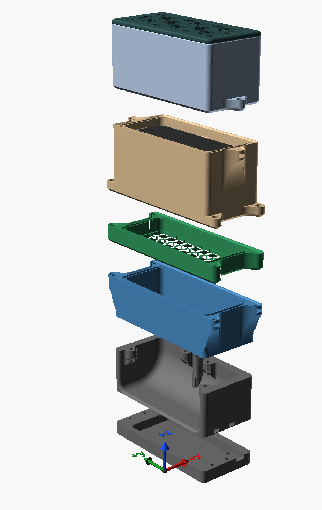

**It takes its HEPA as a cartridge:** a bought one, 80 × 40 × 15 mm, rests on a ledge in its holder. Or
the HEPA paper this build already has, pleated 20 mm deep, in the remix's frame (see *Your own HEPA
paper*).

The remix adds three parts, and takes its bottom from the BentoBox Auto, with nuts for its inserts:

| | What it does | File |
|---|---|---|
| **Section** | Goes between the carbon housing and the fan case, holding a flat filter sheet that stops carbon dust reaching the fans. Its top is the fan case's tongue and its bottom the housing's groove, with the same magnets, so it drops into any BentoBox v2.0 stack. | [`bentobox-section.scad`](../models/bentobox/bentobox-section.scad) |
| **Paper ring** | Stands on the HEPA holder's ledge in place of the cartridge and holds a cut piece of pleated paper. | [`bentobox-hepa-ring.scad`](../models/bentobox/bentobox-hepa-ring.scad) |
| **Paper cap** | Two, in TPU, one on each end of the paper: wedges from above and teeth from below hold the paper's cut end in a zigzag slot, closing its pleats' ends. | [`bentobox-hepa-cap.scad`](../models/bentobox/bentobox-hepa-cap.scad) |
| **Base** | The Auto's, in place of the duct: the bay under it, the wires' tube, and six nuts in slots where it had heat-set inserts. | [`bentobox-auto-base.scad`](../models/bentobox/bentobox-auto-base.scad) |
| **Fan section** | The Auto's, as it comes, in place of the fan case. | [`bentobox-auto-fans.scad`](../models/bentobox/bentobox-auto-fans.scad) |
| **Plate** | The Auto's outline, closing the bay: flush with the base's bottom, its two screws' heads sunk in it. | [`bentobox-auto-plate.scad`](../models/bentobox/bentobox-auto-plate.scad) |

**Not printed yet.** Every fit is checked against the original's STLs (see *Checking it*), not yet against
printed parts.

## The C-MAG

The carbon goes in the C-MAG, not loose in the housing. The C-MAG is two halves that close on four grills.
Lying open, the grills stand across it and make three trays; the user guide says to fill each to a line
moulded inside it, 9 mm deep. Closed and stood on end in the housing, each tray's pellets fall onto the grill
below them and spread over the whole of the C-MAG's inside. That makes three layers, each about **5.35 mm
deep, one above the other**: about 55 cm³ of carbon in all. The LunchBox's bed holds 150 cm³.

**Filled to the top instead**, the C-MAG holds 222 cm³, and the airflow simulation says that costs a
seventh of the flow (see *The air through it*). The author fills it thin for the airflow; here the HEPA
cartridge, not the carbon, is what holds the air back.

The grills are solid plates in their STL; the slicer settings in the author's project turn them into a
honeycomb (the project's plate 3). Print them from the project, not from the STL alone.

## The section

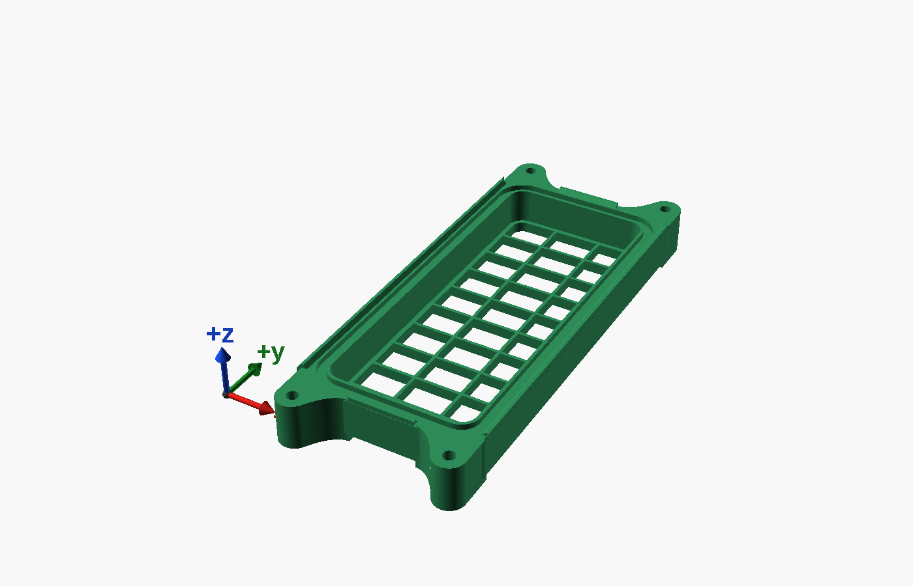

The sheet lies on a grid at the section's bottom, with 5 mm of air above it. The carbon housing's floor has
an opening over each fan only, and that air spreads over the whole sheet before it goes through. Below the
grid is the fan case, with 11 mm of air above the fans.

**The sheet:** polyester filter floss, about 5 mm thick loose, cut to **42 × 102 mm**: a little over the
section's inside, 40.8 × 100.8, so it seals at its edges on the ledge round the grid. It is there for carbon
dust, which is coarse, so it needs to be open, not fine. Change it when it turns grey.

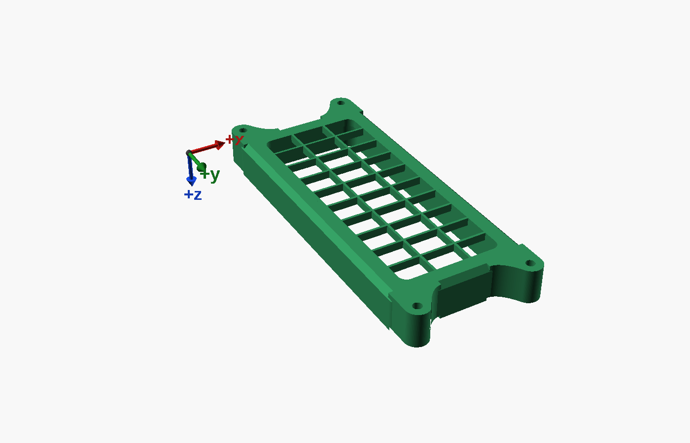

**Magnets:** eight more, 4 × 2 mm like the rest, four in each face. Set the top four's poles as the fan
case's top has them, and the bottom four's as the carbon housing's bottom: the section then meets each
neighbour the way the two of them met.

The groove is 1 mm from each magnet hole, and so it is in every BentoBox part. The section copies that
joint rather than changing it.

## The bottom

The base and the fan section are Strangwooduk's, from the
[BentoBox Auto VOC Sensor system](https://makerworld.com/en/models/1882240), a remix of ThrutheFrame's box.

- **The base is ThrutheFrame's duct**, the same walls and the same curved floor, with the floor raised about
  11 mm over a **bay for the electronics**: about 40 × 95 mm and 7 mm tall, closed by a plate on two screws.
  The base is 46 mm tall where the duct is 52.
- **A tube carries the wires down**: a 6 mm hole in the fan section's floor between the fans, and a tube
  under it through the base to the bay. The two fans' leads go down it; a 4.5 mm bundle passes.
- **The air leaves the same way**: out of the whole long side, 101 × 37 mm (3,700 mm²) where the duct's
  opening is 74 × 46 (3,400 mm²). Both are larger than the fans' own two 37 mm openings, and the HEPA, not
  the duct, sets the flow, so the airflow below, simulated with the duct, should hold within a few per cent.
  The simulation will be run again with this base before the remix is published.
- **The fan section is the fan case's top exactly**: its tongue, its inside and its magnet holes, so the
  section and everything above sit on it unchanged. Each fan is held by two screws, at opposite corners,
  down through the fan section's floor into the base.

The Auto also has a spacer for a sensor between the HEPA holder and the carbon housing, and a 24 V
controller in the bay. Neither is used here. This build's sensors (the same as the
[air-quality monitor's](https://github.com/AlonRR/air-quality-monitor), an SPS30 and an SGP41) will go
**in the base's outlet**, where they read the air after the carbon; the chamber's own monitor reads the air
before it. Their mount is not drawn yet.

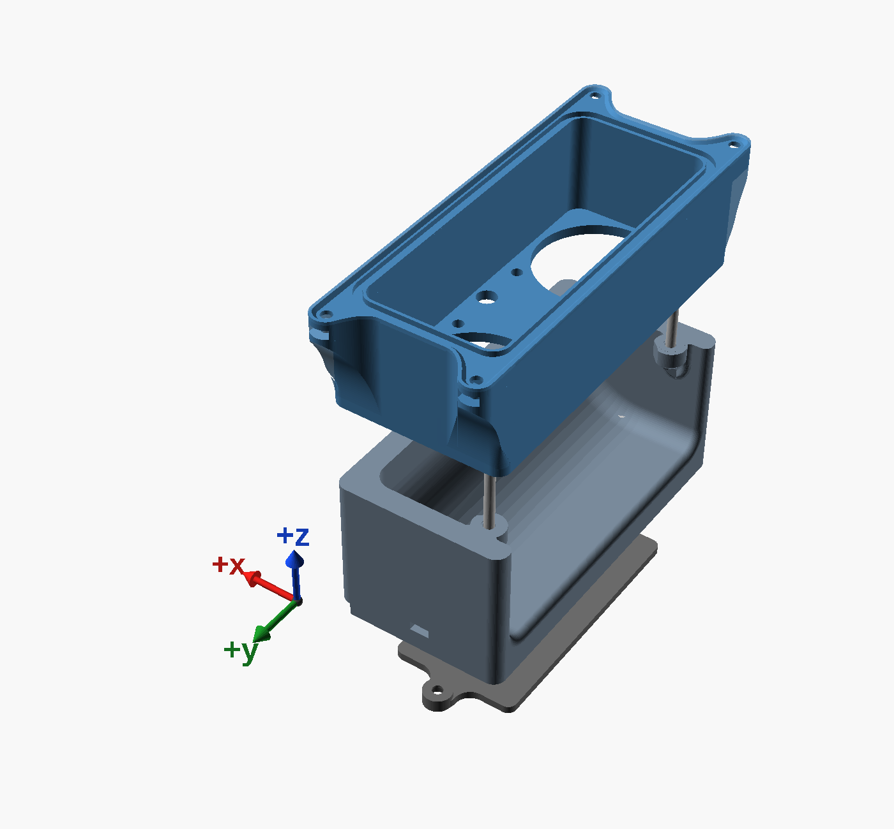

**Nuts, not heat-set inserts.** Each nut lies flat in a slot that opens one way, and the screw holds it there.

- **The fans' four screws**, M3 × 30, come down through each fan and the fan section's floor into a nut
  2 mm under the base's top, in a post on a 45° cone. The two posts at the end walls open to the outlet, so a
  nut goes in, or back in, from outside. The two beside the wires' tube open between the fans. All four are
  cut back clear of the fans' air.
- **The plate's two screws**, M3 × 8 socket head, come up through counterbores in the plate, their heads
  sunk 0.2 mm inside the bottom face, into nuts in slots that open out through the end walls, so a nut goes
  in from outside. The plate fills its recess, flush with the base's bottom, and each counterbore is in a
  lobe that rises into a pocket in the base. The screws sit 1.6 mm nearer the end walls than the Auto's, where
  the duct's floor stands high enough over them.
- Each slot's roof, each counterbore's, and each pocket's starts with two bridging layers, a channel and
  then a square, so the screw's hole prints over it without support.

**Putting it together:** a nut in each end wall's slot, then the plate on with its two screws; a nut
in each of the four posts; the fans' leads down the tube; the fan section on the base, the fans in it, and
their four screws down through them.

**Magnets:** the fan section's top keeps its four, as the fan case has, for the section above it. The
base's underside has four holes for 4 × 2 mm magnets too, from the Auto; magnets there would hold the box
to a steel floor. They are optional.

**Seal the wires' hole.** The hole in the fan section's floor opens above the floor, into the fans' intake,
the lowest pressure in the box, about 97 Pa under the chamber's. The tube under it opens into the bay, and
the bay is open to the chamber: the Auto's cable ports, the gap round the plate, the plate's nut slots. Air
drawn in that way passes neither filter. Through the 6 mm hole with the fans' leads in it, as an orifice,
that is up to about 0.09 L/s, a seventh of the flow. Seal it round the leads where they pass the floor: hot
glue, or a TPU grommet. The LunchBox's wire hole had the same fault, and it let in a fifth of its air.

## Gaskets

The joints between the HEPA holder and the fans, three of them, are under suction: the air under the HEPA is
about 87 Pa below the chamber's, under the C-MAG 93, over the fans 97. Chamber air that leaks in at one of
them passes the filters above it. A 0.1 mm gap round a joint's 300 mm lets in about 0.03 L/s, 5 % of the
flow, and the leak grows as the gap's cube. The cover's joint has the chamber's air on both sides, and the
base's is downstream of the fans, so neither matters.

A printed gasket is a hollow TPU bead in a groove, squeezed a fifth of its height as the parts meet, after
[scad-tools' gasket](https://github.com/AlonRR/scad-tools/blob/main/lib/gasket.scad). It needs force, and
the stack is held by magnets, which give little. How much a bead pushes back with is on no datasheet, so it
is measured first:

[`bentobox-gasket-test.scad`](../models/bentobox/bentobox-gasket-test.scad) is one plate, all in TPU:
three beads side by side, 1.6, 2.0 and 2.5 mm, each 60 mm long, and a bar with the joint's tongue along it
to press them. The bar can be TPU as well: the loads are small, and the tongue's tip barely gives.

Lay the bar's tongue on one bead, load it with a known weight, and measure how far the bead goes down. A
fifth of its height is the squeeze a ring would work at, and the weight that takes it there, over 60 mm, is
the force per millimetre. A joint is about 300 mm round.

## Your own HEPA paper

Pleated HEPA paper off a roll can take the bought cartridge's place. The holder's pocket is 82 × 40.8 mm,
straight for 15.6 mm above the ledge, its ends flaring out above that, so a pack 20 mm deep stands in it.
A ring holds the paper there, with a slot along the foot of each long wall for the paper's edge, and a
TPU cap on each end closes its pleats' ends.

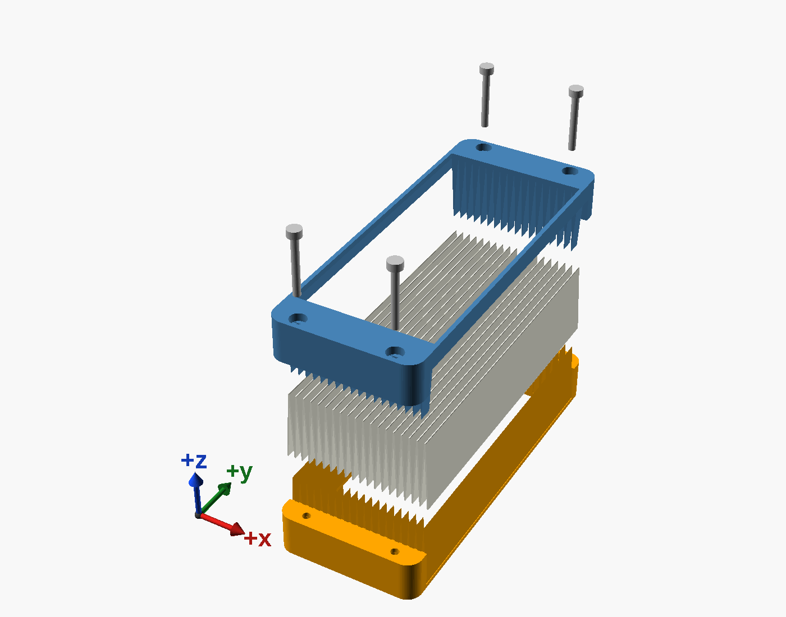

- **Why the ends need closing.** Pleated paper is a row of channels: one open at the top, where the dirty
  air comes in, then one open at the bottom, where it leaves after passing through the paper between them.
  Cut, each channel is open at its ends too, and air could go round the paper there. Each cap has a wedge
  in the end of every channel open at the top and a tooth in the end of every channel open at the bottom,
  so the paper's cut end sits in a zigzag slot between them, 0.5 mm wide for 0.3 mm paper. The dirty side
  is the one at higher pressure, by about 85 Pa, so the air presses the paper onto the teeth and closes
  the slot; with wedges alone it would push the paper away from them. The teeth also hold up the paper's
  ends, which stand over the ledge's opening, and they cover no paper the wedges do not already cover.
- **The long sides.** The paper runs on half a pleat past its last top fold, down to the foot of the
  ring's wall, as a flap. Its cut end stands in a slot between the wall and a strip moulded onto the wall's
  foot, 8 mm tall. Dirty air between the flap and the wall presses the flap onto the strip, the whole
  length of the ring: a strip of contact, not the line of a fold against a wall. At each end the flap runs
  on into the cap's slot, so the seal goes round the corner.

  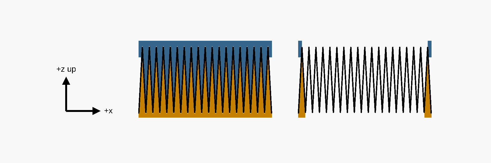
- **Cutting the paper.** For this build's paper, 20 mm deep with about 3.3 mm between top folds: a piece
  **75.7 mm long along the folds, and 10 pleats across with half a pleat more each side** - both long
  edges cut along a bottom fold. Count the pleats rather than measuring the width: folded, that is about
  36.7 mm, and the ring spreads it to 37.2. The roll's 300 × 100 mm pack gives six pieces.
- **Putting it together.** Push a cap onto each end of the piece, with its wedges at the top, where the
  air comes in, and every pleat wall in its slot. Lower the three into the ring, each flap running down
  between the wall and its strip; the ring stands on the ledge like the cartridge. To take it out, lift the
  holder off the stack and tip it over. Print one cap first and try it on an offcut: the slots are barely
  wider than a printed line, and how well TPU keeps them open is for the print to show.
- **If dust gets round it.** Nothing is glued. If a dusty streak ever shows along an edge of the paper's
  underside, run hot glue along that flap in its slot: standard sticks, not low-temperature ones, since the
  chamber runs at about 45 °C during an ASA print. Hot glue peels off the ASA ring, so the ring can still
  be used again.

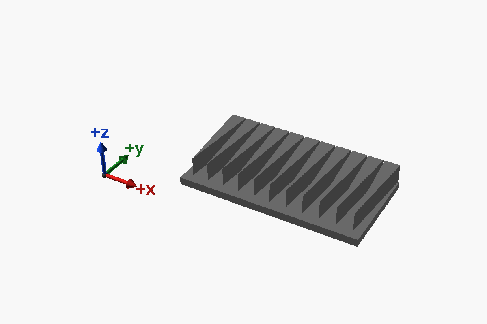

**Other paper:** change its three values in
[`bentobox.params.scad`](../models/bentobox/bentobox.params.scad) - `paper_depth` (fold to fold),
`paper_pitch` (top fold to top fold) and `paper_t` (its thickness) - and export the ring and the cap again.
The ring stands as tall as the paper is deep. The pleats across are the whole number nearest to filling
the ring, and the wedges, teeth and strips are placed to match; rendering either part echoes the new cut.
The slots are `slot_play`, 0.2 mm, wider than `paper_t`: paper thicker than a slot will not go in, and
thinner paper sits loose and is pressed onto the teeth and the strips. `paper_flaps = false` cuts the long
edges on a top fold instead, resting against the wall with no strips; `cap_teeth_below = false` leaves
the wedges alone.

**Still to confirm** for this build's paper: the 3.3 mm between folds is worked out from the roll, 1200 mm
folded into 100, not counted, and the 0.3 mm thickness is an estimate - the one that matters, since it sets
the slot. Anything from 28 to 30 folds in 100 mm gives the same parts.

## Printing

Every original part prints as the author's project lays it out; the remix's print as their files draw
them, the section and the ring bottom down, a cap with its plate on the bed. The base stands on its bottom
face, the fan section on its floor, and the plate on its outer face, its lobes up. No supports, no
brim. Standing, the base's bay roof is a 41 mm bridge, as the Auto has it.

| Part | Material | Count | Time | Filament |
|---|---|---|---|---|
| Section | ASA | 1 | 1 h 43 m | 16 g |
| Paper ring | ASA | 1 | 1 h 8 m | 8 g |
| Paper cap | TPU 95A | 2 | 52 m each | 5 g each |
| Base | ASA | 1 | 4 h 17 m | 44 g |
| Fan section | ASA | 1 | 3 h 21 m | 33 g |
| Plate | ASA | 1 | 37 m | 8 g |
| Gasket test | TPU 95A | 1 | 27 m | 3 g |

Times and weights are PrusaSlicer's, at 0.2 mm with the house profile `0.2mm QUALITY @MK3 - no skirt, no
brim, no crossing perimeter`, as [`scad-check.sh`](https://github.com/AlonRR/scad-tools) slices them, with
`Inslogic TPU 95A` for the caps and the gasket test.

For the bottom:

| Quantity | Item |
|---|---|
| 6 | M3 hex nut, ISO 4032 |
| 4 | M3 × 30 socket head cap screw, ISO 4762: the fans |
| 2 | M3 × 8 socket head cap screw, ISO 4762: the plate, their heads sunk |

## The air through it

An airflow simulation of the whole stack, standing on the chamber's floor with the chamber's air round it:
OpenFOAM, the two Deltas on their published curve, the filters as resistances, on [the LunchBox's](lunchbox-scrubber.md#the-air-through-it)
assumptions but one. The HEPA cartridge's grade is not known, and it sets the flow more than anything
else: the numbers are for the LunchBox's mid-grade paper, folded into this cartridge's 15 mm pleats instead
of 19 mm, which leaves it 15/19 of the paper and so 19/15 of the resistance - a judgement, not a
measurement. How it is built and every assumption in it: [`sim/bentobox-cfd/`](../sim/bentobox-cfd/README.md).

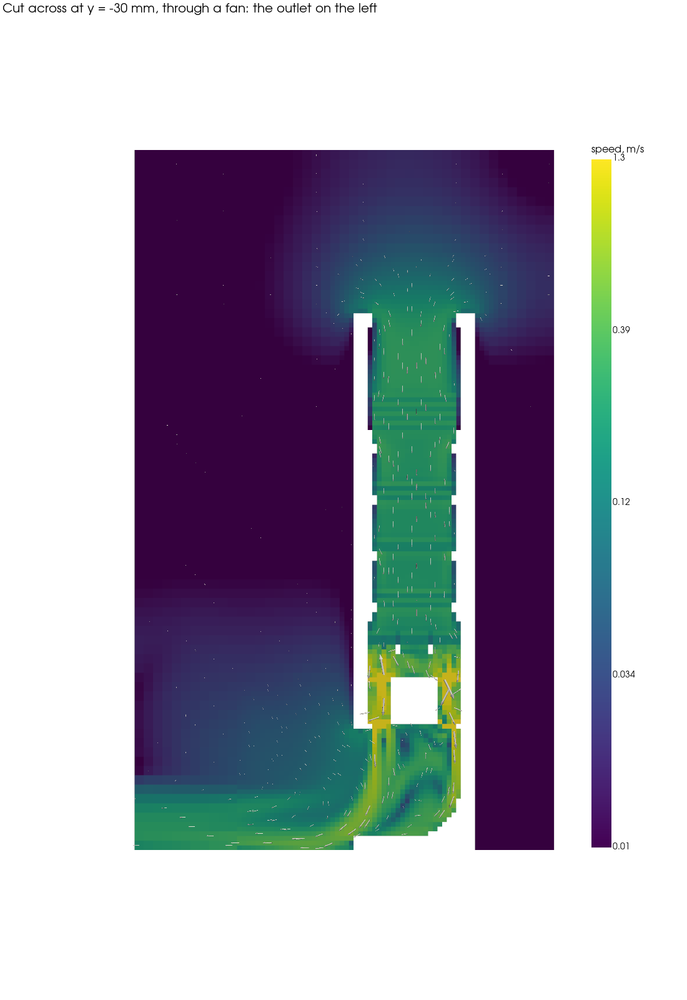

| | As designed | With the section | Section, trays full |
|---|---|---|---|
| Air through the filters | 0.69 L/s | 0.68 L/s | 0.58 L/s |
| ...by the lumped model | 0.68 L/s | 0.65 L/s | 0.57 L/s |
| The HEPA cartridge takes | 91 Pa | 87 Pa | 74 Pa |
| The C-MAG takes | 6 Pa | 6 Pa | 20 Pa |
| The section's sheet takes | | 4 Pa | 3 Pa |
| Time the air spends in the carbon | 81 ms | 83 ms | 387 ms |
| The chamber's 180 L through it every | 4.4 min | 4.5 min | 5.2 min |

- **The HEPA cartridge sets the flow.** It takes about nine tenths of what the fans can give. Its paper sees
  only the 78 × 37 mm opening of its ledge, where the LunchBox's paper sees 70 cm², more than twice as
  much. So the BentoBox moves about half the LunchBox's air (1.3 to 1.5 L/s with its leaks sealed), and
  turns the chamber over every 4.5 minutes where the LunchBox does it every 2 to 2.5. Without the
  19/15 for its shallower pleats - the very same resistance per face as the LunchBox's paper - the lumped
  model gives 0.79 L/s with the section, and the simulation would come out near 0.8: three fifths of the
  LunchBox's air rather than half.
- **The section costs little**: 1.5 % of the flow in the simulation, 4 % by the lumped model. The two
  differ by about as much as the meshes of two cases do. Its sheet is evenly loaded: 0.15 m/s on average,
  nowhere below 0.12, a little less over the grid's two long ribs (on the 1 mm mesh, below).

  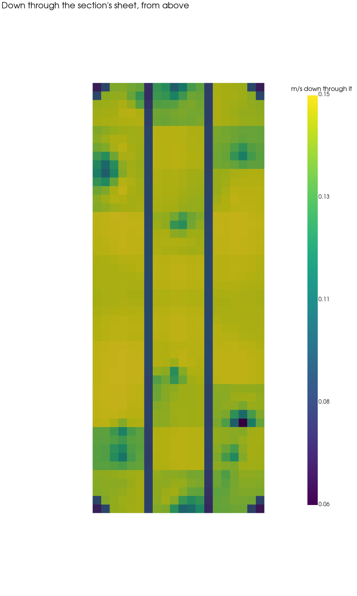
- **Filling the C-MAG's trays full costs a seventh of the flow and quadruples the carbon**: 222 cm³ instead
  of 55, more than the LunchBox's 150, and the air spends nearly five times as long in it. The carbon is
  not what limits this box's flow, so carbon here is cheap.
- **Simulated with ThrutheFrame's duct**, not the Auto's base (see *The bottom*).
- **No leaks in the model.** The air in at the cover and out at the duct agree to within 2 %, and to 1 % on
  every plane between them, and nothing gets round the C-MAG. The model's joints are closed, though; the
  real ones under suction want gaskets, and the Auto's wires' hole wants sealing (see *Gaskets* and
  *The bottom*).
- **Checked on a finer mesh** (1 mm instead of 2, with the section): the air through the filters comes out
  3.5 % lower, **0.65 L/s** instead of 0.68 - the lumped model's figure - and the chamber goes through it
  every 4.6 minutes. The cover, the HEPA's ledge, the housing's floor, the sheet and the fan case's floor
  now carry the same air to within 0.05 %. The other two cases are likely high by about as much, so read
  the table's flows as about 3 % generous; its comparisons between them stand.
- **None of its own air comes back in.** The duct throws the fans' air out along the floor, and the inlet
  is on top, 23 cm above it: in the air modelled round the box, none of it gets back there. A real
  chamber's walls turn it, so take it as a sign, not a number, as on the LunchBox's page.

  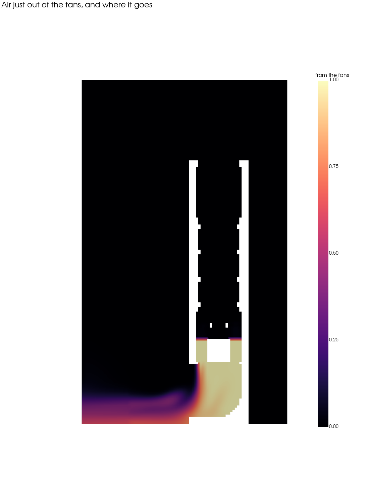

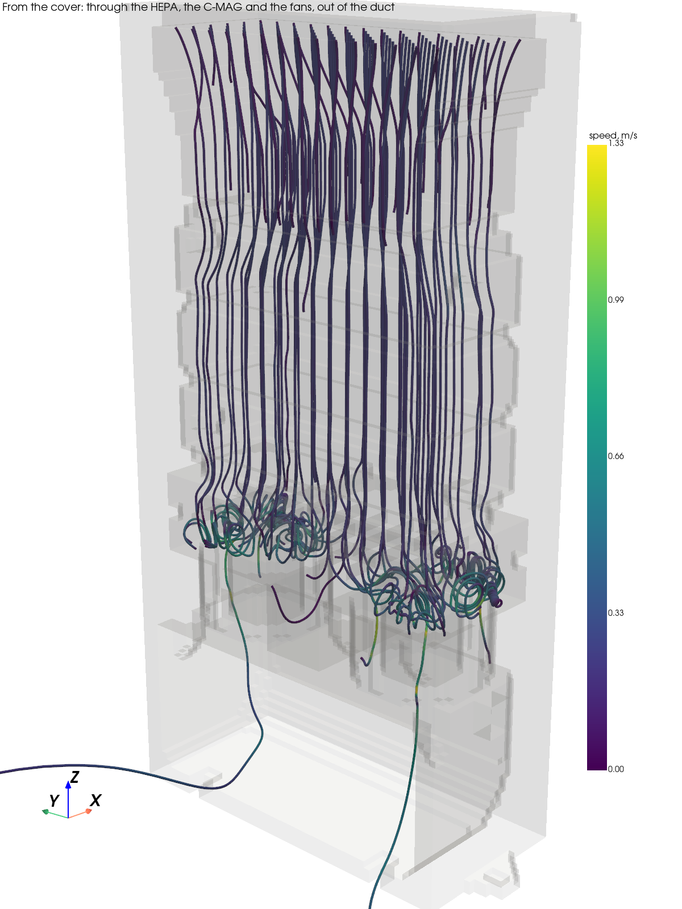

## How long the carbon lasts

An estimate, from [`scripts/carbon-life.py`](../scripts/carbon-life.py), which says where each number comes
from:

- **The carbon** is AP4-60: 4 mm pellets of steam-activated coal, so acid-free in the sense the BentoBox's
  author asks for. Its data sheet gives 450 kg/m³, and how much benzene it holds at four concentrations; an
  isotherm fitted to those, and carried over to styrene, says how much it holds at a chamber's concentration.
- **The fumes** from ASA: 0.5 to 3.5 mg of VOCs an hour of printing, 1.5 in the middle. UL's consolidated
  chamber tests put three quarters of all printers' totals under 1 mg/h and the worst cases, ASA among them,
  over 3. On a Prusa i3, ASA gave off under a quarter of ABS's styrene.
- **The chamber**: every fume goes through the carbon, which sits at 45 °C during an ASA print.

A scrubber keeps the chamber's air clean enough that the carbon only ever sees tens to hundreds of
micrograms of styrene a cubic metre, and there it takes up only 3 to 7 % of its own weight - not the 20 to
40 % a data sheet shows at high concentrations. The BentoBox moves less air, so its chamber runs about twice
as concentrated, and each gram of its carbon holds a little more.

| | Carbon | ASA print hours until it is spent | Range, 3.5 to 0.5 mg/h |
|---|---|---|---|
| LunchBox | 150 cm³, 68 g | about 1,850 | 1,000 to 3,900 |
| BentoBox, the C-MAG filled to its line | 55 cm³, 25 g | about 850 | 460 to 1,800 |
| BentoBox, its trays filled full | 222 cm³, 100 g | about 3,500 | 1,900 to 7,500 |

"Spent" is the carbon in equilibrium with the chamber's air. It lets more through well before then, so
change it sooner: when the smell comes back during a print. Damp air shortens it too - the carbon sits at
room humidity between prints - and whatever the extraction carries out lengthens it.

The lighter fumes, ASA's acrylonitrile among them, stick to plain carbon poorly, and either box lets some
of them through from the start. The HEPA is not what wears out: printing gives off particles by the
billion, but they weigh micrograms.

## Checking it

The model's rules are asserts and warnings in [`bentobox.layout.scad`](../models/bentobox/bentobox.layout.scad).
The fits are checked against the original's STLs, which have to be in
[`models/bentobox/original/`](../models/bentobox/original/), with the Auto's written there from its STEP:

```sh
uv run scripts/bentobox-auto-stl.py                                # the Auto's STLs, from its STEP
OPENSCAD="<the OpenSCAD nightly>" uv run scripts/bentobox-checks.py all
```

It intersects the section with the carbon housing above it and the fan case below it, puts a magnet across
each joint through both parts' holes, and runs the air's way from the housing's floor openings down through
the section. For the paper's frame it stands the ring in the original HEPA holder, runs the ledge's opening
up through the ring's walls, sets the caps' wedges and teeth and the ring's strips in a model of the paper
drawn from the paper's own values, and the caps against the strips. For the bottom it stands the fan
section on the base and the plate in its recess, sets a nut in each slot and slides it out through the
slot's mouth, runs each screw from its head to its tip, and the wires down the tube, and the fans' air
down into the base past the posts. Each must come out empty. Every check has a positive control,
something broken on purpose that it must catch, and the run fails if one passes unnoticed: 17 fits and
22 controls.

[`bentobox.params.scad`](../models/bentobox/bentobox.params.scad) holds the original's dimensions, measured
by sectioning its STLs, and every setting of the section and of the paper's frame.

## Credit and licence

BentoBox v2.0 is © ThrutheFrame, under [CC BY-NC-SA 4.0](https://creativecommons.org/licenses/by-nc-sa/4.0/).
The BentoBox Auto VOC Sensor system, whose base, fan section and plate the bottom is, is © Strangwooduk,
under the same licence as a remix of it.
The remix — the models in [`models/bentobox/`](../models/bentobox/) and the pictures in [`bentobox/`](bentobox/)
— is under CC BY-NC-SA 4.0 too: free to use and share, not for sale.
