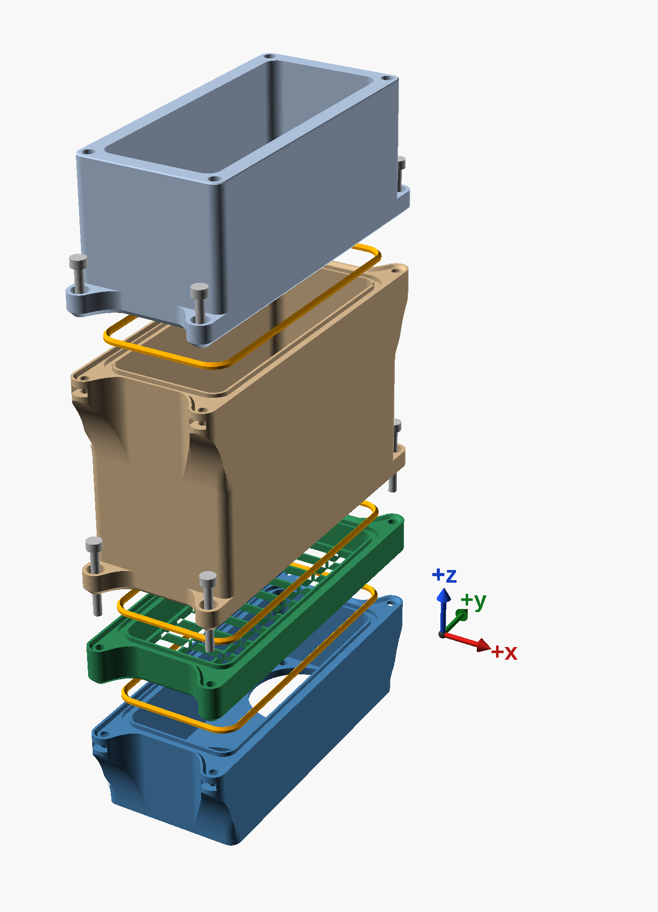
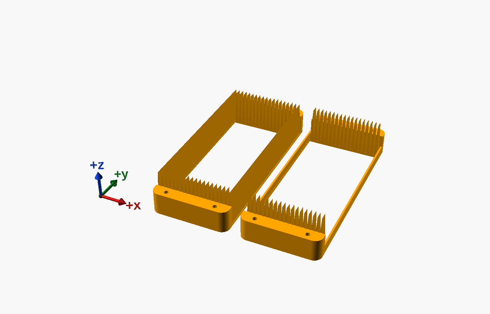
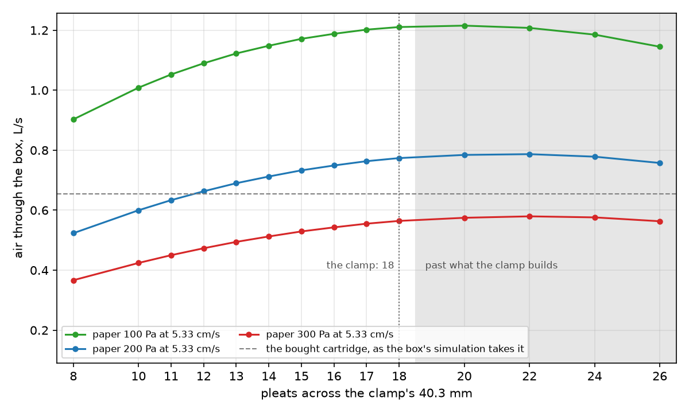

# The other scrubber — BentoBox v2.0, with the C-MAG

ThrutheFrame's [BentoBox v2.0](https://www.printables.com/model/272525) is the other filter weighed for the
chamber, against the [LunchBox](../archive/lunchbox/docs/lunchbox-scrubber.md), now archived. It is a stack of parts, each held to the next by four
magnets and a tongue in a groove. Air comes in through the cover on top and passes a HEPA cartridge. Then it
goes through the C-MAG, a cartridge that holds the carbon pellets in three thin trays, one above the
other. Two 40 mm fans in the fan case pull it down and blow it into the duct, which turns it out of one long
side, at the floor. It is built for the two Delta EFB0412VHD this build has, 40 × 40 × 20 mm.

**Its bottom is after the BentoBox Auto's** (see *The bottom*): the same duct, its floor raised over a bay for
the electronics, drawn from scratch to the Auto's measurements, with a tube down to the bay for the wires, nuts
where the Auto has heat-set inserts, and a USB-C socket for its 12 V. The bay is a tray of its own, screwed on
underneath.

**Its joints under suction are sealed** (see *The sealed joints*): a TPU bead in a groove at each, and screws
in tabs where the original has magnets - four at the corners for each of the two lower joints, one in the middle of
each end for the top one - all turned with a hex screwdriver.

**Its carbon is a bed in the housing** (see *The carbon*): the pellets poured onto the housing's floor, a
honeycomb across its whole inside, 45 mm deep. The C-MAG stays an option.


**It takes its HEPA as a cartridge:** a bought one, 80 × 40 × 15 mm, rests on a ledge in its holder. Or
the HEPA paper this build already has, pleated 20.2 mm deep, in the remix's frame (see *Your own HEPA
paper*).

**Every part the remix prints is drawn here** (Alon, 9 Oct 2026; the cover and the C-MAG too, D142), to the
originals' measurements, read by sectioning their STLs: the base, the tray and the fan section after the Auto's;
the carbon housing, the HEPA holder, the cover and the C-MAG after ThrutheFrame's. Sectioned both ways against the
originals, each matches them to a few hundredths of a millimetre where it keeps their shape; the text moulded into
the originals is left off. The cover's hemp-leaf pattern is drawn from its lattice, and the C-MAG's grills with
their honeycomb, which the author's project left to the slicer (see *The carbon*). None of the remix's parts needs
the author's files to build.

The remix adds four parts, takes its bottom from the BentoBox Auto, and seals the joints under suction:

| | What it does | File |
|---|---|---|
| **Section** | Goes between the carbon housing and the fan section, holding a flat filter sheet that stops carbon dust reaching the fans. Sealed at both its faces, with a pillar at each corner that the carbon housing's screws pass through. `sealed = false` builds it with the original's tongue, groove and magnets, to drop into any BentoBox v2.0 stack. | [`bentobox-section.scad`](../models/bentobox/bentobox-section.scad) |
| **Paper clamp** | Two ASA frames, screwed together with a cut piece of pleated paper between them, standing on the HEPA holder's ledge in place of the cartridge: wedges from above and teeth from below pinch the paper's cut ends, and a bar from each its long edges. | [`bentobox-clamp-lower.scad`](../models/bentobox/bentobox-clamp-lower.scad), [`bentobox-clamp-upper.scad`](../models/bentobox/bentobox-clamp-upper.scad) |
| **Clamp sample** | One end of each frame, on one plate: to try the pinch on an offcut before the whole clamp. | [`bentobox-clamp-sample.scad`](../models/bentobox/bentobox-clamp-sample.scad) |
| **Base** | In place of the duct, drawn to the Auto's: the duct over the bay's roof, the wires' tube, the fans' four nuts pulled up into pockets in posts, and four nuts in slots for the tray's screws. | [`bentobox-auto-base.scad`](../models/bentobox/bentobox-auto-base.scad) |
| **Fan section** | In place of the fan case, drawn to the Auto's: its floor with the fans' openings and screws' holes, its top the sealed joint's, and its wires' hole opened out for the grommet. | [`bentobox-auto-fans.scad`](../models/bentobox/bentobox-auto-fans.scad) |
| **Tray** | The bay under the base, 8 mm tall: its floor and walls, the USB-C trigger board in a pocket in the -Y end with its socket flush with the end face, and four magnet holes; screwed on under the base with four screws, their heads sunk in its bottom face. | [`bentobox-auto-tray.scad`](../models/bentobox/bentobox-auto-tray.scad) |
| **Carbon housing** | Drawn to ThrutheFrame's, with the sealed joints: a collar, the bead's groove and the nuts' tabs on top, the screws' tabs underneath. Its floor is a honeycomb across the whole inside, and the pellets lie on it, 45 mm deep, to a mark on each inside wall (D146); with `carbon = "cmag"`, the original's two openings, for the C-MAG. | [`bentobox-carbon.scad`](../models/bentobox/bentobox-carbon.scad) |
| **HEPA holder** | Drawn to ThrutheFrame's, its bottom sealed on the carbon housing, its pocket the box's whole inside, for a bigger piece of paper, and its top the original cover's, with its magnets. | [`bentobox-hepa.scad`](../models/bentobox/bentobox-hepa.scad) |
| **Cover** | Drawn to ThrutheFrame's hemp-leaf cover: its plate on the HEPA holder, the plug into the holder's top, the magnets' holes, and the window's pattern, drawn from its lattice of triangles. | [`bentobox-cover.scad`](../models/bentobox/bentobox-cover.scad) |
| **C-MAG** | An option, with `carbon = "cmag"`, in place of the bed. Drawn to ThrutheFrame's: the tray and the lid, with the grills' slots and rails, the fill line and the magnets' bosses; and its four grills, with a honeycomb of holes the 4 mm pellets cannot pass. | [`bentobox-cmag-tray.scad`](../models/bentobox/bentobox-cmag-tray.scad), [`bentobox-cmag-lid.scad`](../models/bentobox/bentobox-cmag-lid.scad), [`bentobox-cmag-grills.scad`](../models/bentobox/bentobox-cmag-grills.scad) |
| **Bead ring** | Three, in TPU: the gasket in each sealed joint. | [`bentobox-bead-ring.scad`](../models/bentobox/bentobox-bead-ring.scad) |
| **Grommet** | Two identical TPU halves that close round the fans' leads and click into the fan section's floor, sealing the wires' hole. | [`bentobox-grommet.scad`](../models/bentobox/bentobox-grommet.scad) |
| **Joint sample** | To print first: one end of a sealed joint, sliced off the parts, and a block with one fan nut's pocket - one ASA plate - and its bead, in TPU. | [`bentobox-joint-sample.scad`](../models/bentobox/bentobox-joint-sample.scad), [`bentobox-joint-sample-bead.scad`](../models/bentobox/bentobox-joint-sample-bead.scad) |
| **Bottom sample** | To print first: the tray's -Y end with the USB-C board's pocket, and the base's floor over it with the tray's nut slots - one ASA plate. | [`bentobox-bottom-sample.scad`](../models/bentobox/bentobox-bottom-sample.scad) |
| **Sample plates** | Every sample on two plates, one ASA and one TPU (see *The samples*). | [`bentobox-samples-asa.scad`](../models/bentobox/bentobox-samples-asa.scad), [`bentobox-samples-tpu.scad`](../models/bentobox/bentobox-samples-tpu.scad) |

**Not printed yet.** Every fit is checked in the model (see *Checking it*), not yet against printed parts.

## The carbon

**The pellets lie in the carbon housing** (Alon, 9 Oct 2026: D146), on its floor: a honeycomb across its whole
inside, 221 holes 3.2 mm across their flats, so 3.7 mm across their corners, under the 4 mm pellets, the webs two
beads wide, and 2 mm of solid floor round the edge, where the joint's bead presses. Pour them in with the HEPA
holder off, 45 mm deep, to the mark in the middle of each inside wall - 184 cm³, three times the C-MAG's line - and
level them: the air takes the thinner side of a bed. To change them, the housing comes off the stack, its four
M3 × 25 out, and tips out.

**The housing is 55 mm tall**, where the original's is 77.6, so the box stands 22.6 mm lower: 6 mm of air over
the bed is enough for the air from the HEPA holder's ledge to spread over it. It can be, because the top joint's
screws are in the middle of each end (D147), clear of the lower joints' screws at the corners.

**Why not the C-MAG.** The same airflow models as for the paper's pleats (see *How many pleats*), with the clamp at
18 pleats and the middle grade:

| The carbon | How much | Air through the box | ASA print hours until it is spent |
|---|---|---|---|
| C-MAG, filled to its line | 55 cm³ | 0.77 L/s | about 800 |
| C-MAG, trays full | 222 cm³ | 0.65 L/s | about 3,400 |
| No C-MAG: the housing filled 35 mm deep on a grid | 143 cm³ | 0.74 L/s | about 2,100 |
| **...45 mm deep: the remix** | **184 cm³** | **0.72 L/s** | **about 2,700** |
| ...55 mm deep | 225 cm³ | 0.70 L/s | about 3,400 |

- **A bed over the housing's whole inside does more with the same carbon.** Standing, the C-MAG's three trays are
  three layers one above the other, and they resist as one layer of their total depth would; its walls and the
  gap round it leave the pellets 35 cm² of the housing's 41. Spread over all 41, the carbon of a full C-MAG takes
  7 % more air through, and 45 mm of it holds more than three times the C-MAG's line for 7 % less air. Every grade
  of paper orders them the same way.
- **What the C-MAG gives instead is handling.** It lifts out of the housing once the HEPA holder is off, and it
  holds its pellets in place whichever way the box is turned.
- How long the carbon lasts is `scripts/carbon-life.py`'s estimate at 1.5 mg/h (see *How long the carbon lasts*).

**With the C-MAG** (`carbon = "cmag"`): the housing is the original's height, with the original's two openings in
its floor, and the C-MAG stands in it. The C-MAG is two halves that close on four grills.
Lying open, the grills stand across it and make three trays; the user guide says to fill each to a line
moulded inside it, 9 mm deep. Closed and stood on end in the housing, each tray's pellets fall onto the grill
below them and spread over the whole of the C-MAG's inside. That makes three layers, each about **5.35 mm
deep, one above the other**: about 55 cm³ of carbon in all. The LunchBox's bed holds 150 cm³.

**Filled to the top instead**, the C-MAG holds 222 cm³, and the airflow simulation says that costs a
seventh of the flow (see *The air through it*). The author fills it thin for the airflow; here the HEPA
cartridge, not the carbon, is what holds the air back.

**The grills are drawn with their honeycomb** (D142): 1.4 mm plates, each with 172 holes 3.2 mm across their
flats, so 3.7 mm across their corners, under the 4 mm pellets; the webs between them are two beads wide, and a
rim six beads wide goes round them, of which the rails hide the outer 2.1 mm. That leaves 46 % of a grill open.
The author's grills are solid plates in their STL, which the slicer settings in his project turn into a
honeycomb about half open; the drawn ones print the same in any slicer.

## The section


The sheet lies on a grid at the section's bottom, with 5 mm of air above it. The carbon housing's floor has
an opening over each fan only, and that air spreads over the whole sheet before it goes through. Below the
grid is the fan section, with 11 mm of air above the fans.

**The sheet:** polyester filter floss, about 5 mm thick loose, cut to **42 × 102 mm**: a little over the
section's inside, 40.8 × 100.8, so it seals at its edges on the ledge round the grid. It is there for carbon
dust, which is coarse, so it needs to be open, not fine. Change it when it turns grey.


**No magnets:** both its joints are sealed (see *The sealed joints*), and the carbon housing's four screws
hold it, through its pillars, to the fan section.

## The bottom

The bottom is drawn here, from scratch (Alon, 9 Oct 2026), to the measurements of Strangwooduk's base and fan
section, from the [BentoBox Auto VOC Sensor system](https://makerworld.com/en/models/1882240), a remix of
ThrutheFrame's box.

- **The base is ThrutheFrame's duct** with its floor raised about 11 mm over a **bay for the electronics**, as
  the Auto's is: the floor flat from the outlet, then turning up into the +X wall on a 26 mm radius; the inside's
  edges rounded 6 mm; the walls 7 mm; the outlet's rim rounded 2.5 mm. Sectioned both ways at nine cuts, the
  drawn duct is the Auto's to about 0.05 mm. It has none of the Auto's lugs, cable ports or step.
- **The bay** is 40.8 × 82.8 mm and 8 mm tall (Alon, 9 Oct 2026), where the Auto's is 5.5: the boards in it lie
  flat with wires over them. The box stands 2.5 mm taller for it, 48.5 mm where ThrutheFrame's duct is 52.
- **A tube carries the wires down**: a 6 mm hole in the fan section's floor between the fans, and a tube
  under it, against the +X wall, straight down to the bay. The two fans' leads go down it; a 4.5 mm bundle
  passes.
- **The air leaves the same way**: out of the whole long side, 101 × 37 mm (3,700 mm²) where the duct's
  opening is 74 × 46 (3,400 mm²). Both are larger than the fans' own two 37 mm openings, and the HEPA, not
  the duct, sets the flow, so the airflow below, simulated with the duct, should hold within a few per cent.
  The simulation will be run again with this base before the remix is published.
- **The fan section is the Auto's, drawn**: the fan case's walls and inside, and its floor with each fan's
  37 mm opening and the 3.4 mm holes for its screws. Its top is the sealed joint's (see *The sealed joints*). Each fan is held by two screws, at opposite corners,
  down through the fan section's floor into the base.

The Auto also has a spacer for a sensor between the HEPA holder and the carbon housing, and a 24 V
controller in the bay. Neither is used here. This build's sensors (the same as the
[air-quality monitor's](https://github.com/AlonRR/air-quality-monitor), an SPS30 and an SGP41) will go
**in the base's outlet**, where they read the air after the carbon; the chamber's own monitor reads the air
before it. Their mount is not drawn yet.


**Nuts, not heat-set inserts.** The fans' nuts are pull nuts; the tray's lie flat in slots that open one way.

- **The fans' four screws**, M3 × 30, come down through each fan and the fan section's floor into a pull
  nut, in a post: round at its end, its sides on fillets into its wall, straight down and then on a round into a
  45° underside that meets the wall, and cut back clear of the fan's air - round, it would reach 0.69 mm in under
  the edge of the fan section's floor opening. A hex pocket runs up it on the screw's axis, open under the post,
  into a tight seat 2 mm under the base's top; a screw from above pulls the nut up into the seat, and it stays
  there. Each pocket has a flat 5° off the nearer fan, so it keeps 0.9 mm of wall to the fan's air, and 0.14 mm
  to its wall's face.
- Each nut pocket's roof, and each slot's, starts with two bridging layers, a channel and then a square, so the
  screw's hole prints over it without support.

**The tray.** The base splits at the bay's roof, so that both halves print flat: the base standing on its floor,
the tray on its own floor, open at the top. Printed whole, as the Auto's is, the bay's roof would be a bridge 41 mm
across and 83 long.

- **Its four screws**, M3 × 12 socket head, two at each end, come up through counterbores in the tray, their
  heads sunk 0.2 mm inside its bottom face, into nuts in slots in the base's end walls, just over the bay's
  roof. Each slot opens out through the end face: a nut goes in from outside and slides to the slot's end, on
  its screw's axis. A slot has 0.8 mm under it, four layers, which the nut presses onto the tray's top; low like
  that, its back keeps two beads under the end wall's fillet. The screws stand clear of the magnets' holes and,
  at the -Y end, of the USB-C board's pocket.
- **The USB-C socket** (Alon, 9 Oct 2026). A USB-C PD trigger board takes 12 V from a charger for the fans, and
  a step-down makes 5 V from it for the ESP32. On the charger this build uses, the board gives 12 V (Alon
  measured it, 9 Oct 2026). The board - as Alon measured it, 14.51 mm long with its socket,
  9.97 wide and 1.05 thick, the socket 8.96 × 3.25 and standing 1.55 past the board's edge - lies in a pocket in
  the tray's -Y end, its socket's face flush with the end face: the wall in front of the board is 1.55 mm thick,
  and the board's edge rests against it. The socket goes through a notch open at the top, the board drops into
  its pocket from above, and the base's flat bottom closes both, 0.1 mm over the socket. Behind the board,
  between its two pads, a stop on the bay's floor takes the plug's push. The socket's axis is 8.8 mm over the
  bottom face, so a plug's moulding clears whatever the box stands on.
- **In the bay**, not drawn yet: the step-down (an MP1584EN, 5 V out), an ESP32-C3 SuperMini, and an IRLZ44N
  that switches both fans from the ESP32 (Alon, 9 Oct 2026), a diode across them; the fans' tach wires go to
  two of the ESP32's pins. Lying flat, they fit the 8 mm. Before wiring, check that the charger offers 12 V:
  many offer 5, 9, 15 and 20 V only. The SuperMini's firmware is
  [`firmware/bentobox.yaml`](../firmware/bentobox.yaml), with the pin for each wire in its header: flashed
  9 Oct 2026 and updated over the air since, it reports to Home Assistant over MQTT, and the fans are on unless
  switched off there.

**Putting it together:** the USB-C board into its pocket, its wires soldered on; a nut in each of the four slots
 in the end faces, pushed to the slot's end, then the
tray under the base with its four screws; it comes off again from below, for the electronics. Then the fans'
nuts, from the open top of the base: slide each nut in under its post, push it up the pocket, and pull
it into the seat with a spare M3 screw from above; take the screw out, and the nut stays. The fans' leads down
the tube; the fan section on the base, the fans in it, and their four screws down through them. The seat's
fit is a first guess: try it on the joint sample first (see *The sealed joints*).

**Magnets:** none at the fan section's top, whose joint is sealed. The base's underside has four holes for
4 × 2 mm magnets, from the Auto; magnets there would hold the box to a steel floor. They are optional.

**Seal the wires' hole.** The hole in the fan section's floor opens above the floor, into the fans' intake,
the lowest pressure in the box, about 97 Pa under the chamber's. The tube under it opens into the bay, and
the bay is open to the chamber at the tray's joint, round the USB-C socket, and wherever wires leave it. Air
drawn in that way passes neither filter. Through the 6 mm hole with the fans' leads in it, as an orifice,
that is up to about 0.09 L/s, a seventh of the flow. The LunchBox's wire hole had the same fault, and it let in a
fifth of its air. So the leads pass the floor in a **grommet** (Alon, 9 Oct 2026):

- **Two identical TPU halves**, split through the hole for the leads, 4 mm across, which squeezes the leads'
  4.5 mm bundle. On each half's split face, beside the leads, is a small key with 45° sides and a flat top on one
  side and the matching slot on the other: turn one half round and the two lock together round the leads.
  The key's bottom runs out of the face at 45°, so it prints standing without hanging over the air; its top
  is flat.
  Across the leads' hole, at the grommet's foot, is a thin skin, two layers: closed, the two halves' skins
  pinch the leads between them.
- **The floor's hole is opened out to 7.6 mm** for it, 0.8 mm off the tube's axis towards -X so it stays clear of
  the fan section's +X wall, with a groove round it at mid-height, 45° each side, and a chamfer at the top. Round
  the grommet, a lip with 45° sides clicks into the groove. The grommet is 0.1 mm proud of the hole all round, so
  it seals, and as thick as the floor, 3 mm, so it sits flush both sides.
- **Putting it in:** the fans' leads down the tube; the two halves closed round them, key in slot; the pair
  pushed down into the floor's hole from inside the fan section until the lip clicks into the groove.

## The sealed joints

The joints between the HEPA holder and the fans, three of them, are under suction: the air under the HEPA is
about 87 Pa below the chamber's, under the C-MAG 93, over the fans 97. Chamber air that leaks in at one of
them passes the filters above it. A 0.1 mm gap round a joint's 300 mm lets in about 0.03 L/s, 5 % of the
flow, and the leak grows as the gap's cube. The cover's joint has the chamber's air on both sides, and the
base's is downstream of the fans, so those two stay as they are.

So the section on the fan section, the carbon housing on the section, and the HEPA holder on the carbon
housing are sealed:

- **A bead in a groove.** A hollow TPU bead, 2 mm, its wall one perimeter, after
  [scad-tools' gasket](https://github.com/AlonRR/scad-tools/blob/main/lib/gasket.scad), lies in a groove
  2.5 × 1.6 mm in the lower part's top, round the inside. It stands 0.4 mm proud; the upper part's flat
  bottom presses it down as the two faces meet, a fifth of its height. Its hollow is vented through its
  inner wall, to the box's inside: a dead end, and the outer wall and the ridge seal. The bead's size is a
  first choice, not yet tried in print.
- **The upper part sits in the lower one.** A collar 1 mm tall runs round the lower part's top edge, round
  the tabs too, its inner face at 45 degrees; the upper part's bottom edge, tabs and all, is cut back at 45
  degrees to sit in it, 0.2 mm clear. It centres the parts, and it is a second barrier outside the bead. Both
  print without support.
- **Tabs and screws, where the magnets were.** The two lower joints have a tab at each corner; the top joint,
  the HEPA holder on the carbon housing, one in the middle of each end (Alon, 9 Oct 2026: D147), so nothing stands
  over the lower joints' screws, which go in first. Each tab stands 9.4 mm past the end wall.
  The tabs are seamless with the walls and floors: each part's outline is one shape, tabs and all, so a
  corner tab's side runs straight on from the side face, a tab's outline leaves the end wall along a parabola,
  tangent to it - on both sides of a middle tab - and its floor or top is the part's own. For that the originals' outsides are cut 0.05 mm inside
  their own faces, a quarter of a layer, and their floors and tops at a sealed joint likewise. Under each
  nut's tab, a bracket whose face is a cubic in its height: tangent to the wall at its foot, 45 degrees at
  the tab, so it prints without support. In the rounded corner under a corner tab it fills the corner
  smoothly, so the side face runs on into the bracket's side. The fan section is shorter than a bracket, so its
  brackets run down to its bottom. Each nut slides in from the tab's end.
- **The screws.** Two M3 × 12 through the HEPA holder's tabs into nuts in the carbon housing's. Four
  M3 × 25 through the carbon housing's bottom tabs and pillars in the section into nuts in the fan
  section's: one screw at each corner holds both of the section's joints. Each head sinks flush into a
  counterbore in its tab, 0.2 mm under the top: the upper parts' tabs stand 8.2 mm, 5 mm of it under the
  head. They are socket heads, turned with a 2.5 mm hex screwdriver (Q148).



**Putting it together:** a bead ring in the groove on the fan section, the section and the carbon housing;
a nut in each tab of the fan section and the carbon housing; the section on the fan section, the carbon
housing on the section, and the four M3 × 25 down through them, with a 2.5 mm hex screwdriver, straight down:
nothing stands over them. Then the HEPA holder on the carbon housing and its two M3 × 12, and the cover on its
magnets. The checks stand a screwdriver with a 75 mm blade and a 30 mm handle on every head, straight up, the lower
screws' before the HEPA holder is on, and find nothing in its way.

The sheet in the section, the carbon and the HEPA come out by the same screws. Only the cover's joint keeps
magnets: four in the HEPA holder's top and four in the cover.

**Try one end first.** The bead's size and the seat's fit are first guesses, and the carbon housing is a
6-hour print. The joint sample is one end of the joint between the carbon housing and the HEPA holder, sliced
off the parts themselves: the carbon housing's top 12 mm, with its nut tab, and the HEPA holder's bottom
10 mm, with its counterbored tab, 30 mm in from the end wall. With them on the plate is a block holding
one fan nut's pocket as the base has it. Lay the TPU bead in the lower piece's groove, the nut in its tab, set
the upper piece on in its collar and drive the M3 × 12: the faces should come together on the bead,
pressing it down, the chamfer should sit in the collar, and each head should end flush. Pull a nut into the
block's seat with an M3 × 8 and take the screw out: the nut should stay.

`sealed = false` in [`bentobox.params.scad`](../models/bentobox/bentobox.params.scad) builds every part as
the original has it: magnets, a tongue on each top, a groove under each bottom.

## Your own HEPA paper

Pleated HEPA paper off a roll can take the bought cartridge's place. The original holder's pocket is
82 × 40.8 mm, sized for the 80 mm cartridge: its ends are solid, flaring out only 15.6 mm above the ledge. The
remix cuts the pocket out to the box's whole inside, 100.8 × 40.8 mm with its rounded corners, from the ledge
up, and the ledge's opening with it, to 87.5 × 36.8 mm (78 × 36.8 on the original).

A clamp holds the paper there: two ASA frames with a cut piece of paper between them, screwed together into a
cassette that stands on the ledge, 100.5 × 40.5 mm. It takes a piece 87.1 mm long and 40.3 mm across - 18
pleats and a half each side (D143) - where the bought cartridge is 80 × 40 and the original's pocket took 75.7 ×
37.2 of this paper: 25 % more paper than that.


- **Why the ends need closing.** Pleated paper is a row of channels: one open at the top, where the dirty
  air comes in, then one open at the bottom, where it leaves after passing through the paper between them.
  Cut, each channel is open at its ends too, and air could go round the paper there. At each end the upper
  frame has a wedge in every channel open at the top, and the lower frame a tooth in every channel open at
  the bottom, 4 mm into the paper. Screwed together they leave a zigzag slot 0.2 mm wide for 0.4 mm paper:
  the four screws pinch the paper's cut end between the wedges and the teeth. The pleats' walls lean only
  3° from upright, so the last millimetre of the screws' travel closes the slot.
- **The long sides.** The paper runs on half a pleat past its last top fold, down to the lower frame's rim,
  as a flap. The upper frame's half wedge runs down outside it, the whole length, and the lower frame's tooth
  under the last top fold inside it: the screws pinch the flap between them too.
- **One hard stop.** Each end is a block in two halves, the upper frame's on the lower's, and the frames meet
  nowhere else: the band round the top and the rim round the bottom stand 0.2 mm clear of the paper's folds,
  so the slot's width is set by the frames, not by the paper.

  
- **The screws.** Four M2 × 16 socket head, two at each end, from the top, their heads sunk in the upper
  frame, into M2 nuts pulled up into seats in the lower frame, as the fans' nuts are in the base. M2, not the
  M2.5 first drawn: an end block is 6.5 mm along the pleats, and an M2.5 nut's pocket leaves it under two
  beads of wall.
- **Cutting the paper.** For this build's paper, 20.2 mm deep, held 2.1 mm between top folds: a piece
  **87.1 mm long along the folds, and 18 pleats across with half a pleat more each side** - both long edges
  cut along a bottom fold. Count the pleats rather than measuring the width: the paper squeezes up tight or
  spreads out, and the clamp spreads it to 40.3. The sheet's 31 pleats make one piece across, and its 300 mm three along: three pieces.
- **Putting it together.** Pull an M2 nut into each of the lower frame's four seats with a spare M2 screw from
  above, and take the screw out: the nut stays. Lay the lower frame down, teeth up, and the paper on it, its
  channels open at the bottom over the teeth at each end and each flap's cut end on the rim outside the long
  teeth. Lower the upper frame on, its wedges into the channels open at the top and its half wedges outside
  the flaps, and drive the four screws until the end blocks meet. Drop the cassette onto the holder's ledge;
  to take it out, lift the holder off the stack and tip it over.
- **Try it first.** The slot's 0.2 mm is a first guess: it pinches the 0.4 mm paper to half. Print the clamp sample
  - one end of each frame, an hour - clamp an offcut 16 mm long in it, and look at the cut end: the paper should
  be pinched all along the zigzag without being cut.



**Other paper:** change its values in [`bentobox.params.scad`](../models/bentobox/bentobox.params.scad) -
`paper_depth` (fold to fold), `paper_pitch` (top fold to top fold) and `paper_t` (its thickness), and
`clamp_slot` a little under `paper_t` - and export the frames again. The clamp stands as tall as the paper is
deep. The pleats across are the whole number nearest to filling it, and the wedges and teeth are placed to
match; rendering either frame echoes the new cut. `paper_flaps = false` cuts the long edges on a top fold
instead.

**Measured** for this build's paper (Alon, 9 Oct 2026, Q95): it is 0.4 mm thick and its folds are 20.2 mm deep;
31 folds squeeze up to about 26 mm. The 2.1 mm between top folds is the clamp's, not the paper's: pleated paper
spreads to any pitch, and `paper_pitch`, 2.12 mm, is chosen for 18 pleats (see *How many pleats*). Anything from
2.07 to 2.17 mm gives the same 18.

**How many pleats** (Alon, 9 Oct 2026: D143, 18). An airflow model of one pleat of
this paper, run for each count the clamp might hold and put into the box's model of the fans and its other
filters ([`sim/bentobox-cfd/pleat.py`](../sim/bentobox-cfd/README.md#one-pleat-of-your-own-paper-how-many-pleats-the-clamp-should-hold)):



- **The most air comes at 20 to 22 pleats**, whatever the paper's grade, and anything from 18 to 24 is within 3 %
  of it. More pleats put more paper in the air's way, but near each fold the two sheets touch, over more of the
  paper's depth as the pleats close up, and the channels between them narrow; past 22 those cost more than the
  added paper gives.
- **The clamp builds up to 18**: at 19 its half wedges along the long sides come out under 3 mm. At 18 the box
  moves 15 to 25 % more air than at the 11 it held before - 0.77 L/s instead of 0.63 on the middle grade. Against the bought
  cartridge, as the box's simulation takes it, the grade decides: 18 % more air on the middle grade, less on the
  300 Pa one.
- **18 pleats take 19 of the sheet's 31** with the half pleats each side, so the sheet gives three pieces; at 14
  or fewer it gives six. 14 pleats move 8 % less air than 18.
- **The paper's grade is not known**, and it sets how much air, not where the top is: the model runs it at 100,
  200 and 300 Pa across the flat paper at 5.33 cm/s. Checked on a mesh of half the cells' size, every count's drop
  moves by the same 1.4 to 2.1 %.

## The samples

Some of the remix's fits are first guesses, and its big parts are long prints, so the samples come first: every
one of them on two plates, [`bentobox-samples-asa.scad`](../models/bentobox/bentobox-samples-asa.scad) and
[`bentobox-samples-tpu.scad`](../models/bentobox/bentobox-samples-tpu.scad) (each sample has its own file too).

- **The joint sample** and its TPU bead - one end of a sealed joint, and a fan nut's seat (see *The sealed
  joints*).
- **The clamp sample** - one end of each of the paper clamp's frames (see *Your own HEPA paper*).
- **The bottom sample** - the tray's -Y end, 18 mm of it, and the base's floor over it, 7 mm. Drop the USB-C
  trigger board into its pocket: its socket's face should sit flush with the end face, and a USB-C plug should go
  all the way in, the stop behind the board taking the push. Slide a nut into each of the two slots in the base's
  piece, from the end face, set it on the tray's piece and drive the two M3 × 12 up from below: the pieces should
  pull together, the heads ending flush, and the base's flat bottom closing the socket's notch.
- **The grommet's coupon and halves** - a 3 mm square of the fan section's floor with its grommet hole, in ASA,
  and the grommet's two halves, in TPU. Close the halves round a few spare leads, key in slot, and push the pair
  into the coupon's hole until it clicks: it should sit flush and hold, and the leads should not slide easily.

## Printing

Every part prints as its file draws it, standing on its bottom - the section, the base on its floor, the tray,
the fan section, the carbon housing and the HEPA holder - the cover on its top face, the clamp's lower frame on its
rim and its upper frame turned over onto its band, and a bead ring flat. With the C-MAG, its parts print from their
own files: the tray on its floor, the lid on its top face, the grills flat. No supports, no brim. `sh scripts/bentobox-print.sh` builds every one, checks it and slices
it, and puts its STL and G-code in `models/bentobox/print/`; name parts to build only those - `samples-asa
samples-tpu` for the two sample plates.

| Part | Material | Count | Time | Filament |
|---|---|---|---|---|
| Section | ASA | 1 | 1 h 57 m | 17 g |
| Clamp, lower frame | ASA | 1 | 1 h 28 m | 10 g |
| Clamp, upper frame | ASA | 1 | 1 h 11 m | 8 g |
| Clamp sample | ASA | 1 plate | 1 h 7 m | 7 g |
| Base | ASA | 1 | 3 h 25 m | 36 g |
| Fan section | ASA | 1 | 3 h 42 m | 36 g |
| Tray | ASA | 1 | 1 h 47 m | 20 g |
| Carbon housing | ASA | 1 | 6 h 22 m | 57 g |
| HEPA holder | ASA | 1 | 4 h 32 m | 44 g |
| Cover | ASA | 1 | 1 h 53 m | 13 g |
| Bead ring | TPU 95A | 3 | 9 m each | 1 g each |
| Joint sample | ASA | 1 plate | 1 h 7 m | 10 g |
| Joint sample's bead | TPU 95A | 1 | 3 m | under 1 g |
| Grommet | TPU 95A | 2 halves | 2 m | under 1 g |
| Bottom sample | ASA | 1 plate | 45 m | 7 g |
| Samples, ASA | ASA | 1 plate | 3 h 5 m | 25 g |
| Samples, TPU | TPU 95A | 1 plate | 5 m | under 1 g |

Times and weights are PrusaSlicer's, at 0.2 mm with the house profile `0.2mm QUALITY @MK3 - no skirt, no
brim, no crossing perimeter`, as [`scad-check.sh`](https://github.com/AlonRR/scad-tools) slices them, with
`Inslogic TPU 95A` for the bead rings.

For the bottom:

| Quantity | Item |
|---|---|
| 8 | M3 hex nut, ISO 4032 |
| 4 | M3 × 30 socket head cap screw, ISO 4762: the fans |
| 4 | M3 × 12 socket head cap screw, ISO 4762: the tray, their heads sunk |

For the sealed joints:

| Quantity | Item |
|---|---|
| 6 | M3 hex nut, ISO 4032 |
| 4 | M3 × 25 socket head cap screw, ISO 4762: the carbon housing and the section to the fan section |
| 2 | M3 × 12 socket head cap screw, ISO 4762: the HEPA holder to the carbon housing |
| 8 | 4 × 2 mm magnet: the cover's joint, four in the HEPA holder and four in the cover |

With the C-MAG: 8 more 4 × 2 mm magnets, four in each half. Its parts, in ASA: the tray 2 h 16 m and 25 g, the
lid 1 h 49 m and 21 g, the four grills on one plate 1 h 51 m and 11 g.

For the joint sample, from the same stock: 2 M3 nuts, 1 M3 × 12 and 1 M3 × 8. Every screw is turned with a
2.5 mm hex screwdriver, its blade 75 mm or longer. For the bottom sample: 2 M3 nuts,
2 M3 × 12 and the USB-C trigger board.

For the paper's clamp:

| Quantity | Item |
|---|---|
| 4 | M2 hex nut, ISO 4032 |
| 4 | M2 × 16 socket head cap screw, ISO 4762, and a spare to pull the nuts in with |

## The air through it

This is the original's stack, with the C-MAG and the bought cartridge; the remix's paper and its bed of carbon are
compared under *How many pleats* and *The carbon*. An airflow simulation of the whole stack, standing on the chamber's floor with the chamber's air round it:
OpenFOAM, the two Deltas on their published curve, the filters as resistances, on [the LunchBox's](../archive/lunchbox/docs/lunchbox-scrubber.md#the-air-through-it)
assumptions but one. The HEPA cartridge's grade is not known, and it sets the flow more than anything
else: the numbers are for the LunchBox's mid-grade paper, folded into this cartridge's 15 mm pleats instead
of 19 mm, which leaves it 15/19 of the paper and so 19/15 of the resistance - a judgement, not a
measurement. How it is built and every assumption in it: [`sim/bentobox-cfd/`](../sim/bentobox-cfd/README.md).


| | As designed | With the section | Section, trays full |
|---|---|---|---|
| Air through the filters | 0.69 L/s | 0.68 L/s | 0.58 L/s |
| ...by the lumped model | 0.68 L/s | 0.65 L/s | 0.57 L/s |
| The HEPA cartridge takes | 91 Pa | 87 Pa | 74 Pa |
| The C-MAG takes | 6 Pa | 6 Pa | 20 Pa |
| The section's sheet takes | | 4 Pa | 3 Pa |
| Time the air spends in the carbon | 81 ms | 83 ms | 387 ms |
| The chamber's 180 L through it every | 4.4 min | 4.5 min | 5.2 min |

- **The HEPA cartridge sets the flow.** It takes about nine tenths of what the fans can give. Its paper sees
  only the 78 × 37 mm opening of the original's ledge (the remix's is 90 × 37, for a bigger piece of paper;
  these numbers are for the original), where the LunchBox's paper sees 70 cm², more than twice as
  much. So the BentoBox moves about half the LunchBox's air (1.3 to 1.5 L/s with its leaks sealed), and
  turns the chamber over every 4.5 minutes where the LunchBox does it every 2 to 2.5. Without the
  19/15 for its shallower pleats - the very same resistance per face as the LunchBox's paper - the lumped
  model gives 0.79 L/s with the section, and the simulation would come out near 0.8: three fifths of the
  LunchBox's air rather than half.
- **The section costs little**: 1.5 % of the flow in the simulation, 4 % by the lumped model. The two
  differ by about as much as the meshes of two cases do. Its sheet is evenly loaded: 0.15 m/s on average,
  nowhere below 0.12, a little less over the grid's two long ribs (on the 1 mm mesh, below).

  
- **Filling the C-MAG's trays full costs a seventh of the flow and quadruples the carbon**: 222 cm³ instead
  of 55, more than the LunchBox's 150, and the air spends nearly five times as long in it. The carbon is
  not what limits this box's flow, so carbon here is cheap.
- **Simulated with ThrutheFrame's duct**, not the Auto's base (see *The bottom*).
- **No leaks in the model.** The air in at the cover and out at the duct agree to within 2 %, and to 1 % on
  every plane between them, and nothing gets round the C-MAG. The model's joints are closed, though; the
  real ones under suction are sealed, and the Auto's wires' hole wants sealing (see *The sealed joints* and
  *The bottom*).
- **Checked on a finer mesh** (1 mm instead of 2, with the section): the air through the filters comes out
  3.5 % lower, **0.65 L/s** instead of 0.68 - the lumped model's figure - and the chamber goes through it
  every 4.6 minutes. The cover, the HEPA's ledge, the housing's floor, the sheet and the fan case's floor
  now carry the same air to within 0.05 %. The other two cases are likely high by about as much, so read
  the table's flows as about 3 % generous; its comparisons between them stand.
- **None of its own air comes back in.** The duct throws the fans' air out along the floor, and the inlet
  is on top, 23 cm above it: in the air modelled round the box, none of it gets back there. A real
  chamber's walls turn it, so take it as a sign, not a number, as on the LunchBox's page.

  


## How long the carbon lasts

An estimate, from [`scripts/carbon-life.py`](../scripts/carbon-life.py), which says where each number comes
from:

- **The carbon** is AP4-60: 4 mm pellets of steam-activated coal, so acid-free in the sense the BentoBox's
  author asks for. Its data sheet gives 450 kg/m³, and how much benzene it holds at four concentrations; an
  isotherm fitted to those, and carried over to styrene, says how much it holds at a chamber's concentration.
- **The fumes** from ASA: 0.5 to 3.5 mg of VOCs an hour of printing, 1.5 in the middle. UL's consolidated
  chamber tests put three quarters of all printers' totals under 1 mg/h and the worst cases, ASA among them,
  over 3. On a Prusa i3, ASA gave off under a quarter of ABS's styrene.
- **The chamber**: every fume goes through the carbon, which sits at 45 °C during an ASA print.

A scrubber keeps the chamber's air clean enough that the carbon only ever sees tens to hundreds of
micrograms of styrene a cubic metre, and there it takes up only 3 to 7 % of its own weight - not the 20 to
40 % a data sheet shows at high concentrations. The BentoBox moves less air, so its chamber runs about twice
as concentrated, and each gram of its carbon holds a little more.

| | Carbon | ASA print hours until it is spent | Range, 3.5 to 0.5 mg/h |
|---|---|---|---|
| LunchBox | 150 cm³, 68 g | about 1,850 | 1,000 to 3,900 |
| BentoBox, the C-MAG filled to its line | 55 cm³, 25 g | about 850 | 460 to 1,800 |
| BentoBox, its trays filled full | 222 cm³, 100 g | about 3,500 | 1,900 to 7,500 |
| The remix: a 45 mm bed, with the paper clamp | 184 cm³, 83 g | about 2,700 | 1,500 to 5,800 |

"Spent" is the carbon in equilibrium with the chamber's air. It lets more through well before then, so
change it sooner: when the smell comes back during a print. Damp air shortens it too - the carbon sits at
room humidity between prints - and whatever the extraction carries out lengthens it.

The lighter fumes, ASA's acrylonitrile among them, stick to plain carbon poorly, and either box lets some
of them through from the start. The HEPA is not what wears out: printing gives off particles by the
billion, but they weigh micrograms.

## Checking it

The model's rules are asserts and warnings in [`bentobox.layout.scad`](../models/bentobox/bentobox.layout.scad).
The fits are checked against the original's STLs, which have to be in
[`models/bentobox/original/`](../models/bentobox/original/), with the Auto's written there from its STEP:

```sh
uv run scripts/bentobox-auto-stl.py                                # the Auto's STLs, from its STEP
OPENSCAD="<the OpenSCAD nightly>" uv run scripts/bentobox-checks.py all
```

For the sealed joints it stands each upper part on its lower one - flat on the land, its chamfer in the
collar, tab on tab - lays each bead in its groove, runs each screw from its head to its tip through the tabs
and the section's pillars, sets a nut in each slot and slides it out through the tab's end, and stands a hex
screwdriver on each screw's head, straight up, with nothing in its way. With `sealed=false` it checks the original's joints: the section against
the carbon housing above it and the fan section below it, a magnet across each joint through both parts'
holes. It runs the air's way from the housing's floor - its honeycomb, or with the C-MAG its two openings - down through
the section. It stands the cover on the HEPA holder, its plug in the holder's top, a magnet across the joint
at each corner. With `carbon = "cmag"` it stands the C-MAG in the carbon housing, clear of its walls and of the HEPA holder; and
it closes the C-MAG's lid
on its tray, a magnet across their joint at each corner, and sets the four grills in their slots. For the paper's clamp it stands the cassette in the cut-out HEPA holder, sets the
upper frame on the lower one - meeting only at the end blocks - lays a model of the paper, drawn from its own
values at the slot's thickness, in the frames' zigzag, keeps the air's way down under the paper open, and
runs the four screws through the end blocks and the nuts into their seats and down out of them. It closes the
grommet's two halves on each other, key in slot, and sets the pair in the fan section's floor, lip in groove. For the bottom it stands the fan
section on the base and the base on the tray, lays the USB-C board in its pocket - its socket through its notch,
flush with the end face - sets a nut in each of the tray's slots and slides it out through
the end face, and one in each fan screw's seat and draws it down its pocket and out under its post, keeps two
beads of the end wall round each tray slot and its screw's hole, runs each screw from its head to its tip, and
the wires down the tube, and the fans' air down into the base past the posts. Each must come out empty. Every check has a positive control,
something broken on purpose that it must catch, and the run fails if one passes unnoticed: 37 fits and
46 controls.

[`bentobox.params.scad`](../models/bentobox/bentobox.params.scad) holds the original's dimensions, measured
by sectioning its STLs, and every setting of the section and of the paper's frame.

## Credit and licence

BentoBox v2.0 is © ThrutheFrame, under [CC BY-NC-SA 4.0](https://creativecommons.org/licenses/by-nc-sa/4.0/).
The BentoBox Auto VOC Sensor system, whose base and fan section the bottom is drawn after, is © Strangwooduk,
under the same licence as a remix of it.
The remix — the models in [`models/bentobox/`](../models/bentobox/) and the pictures in [`bentobox/`](bentobox/)
— is under CC BY-NC-SA 4.0 too: free to use and share, not for sale.
