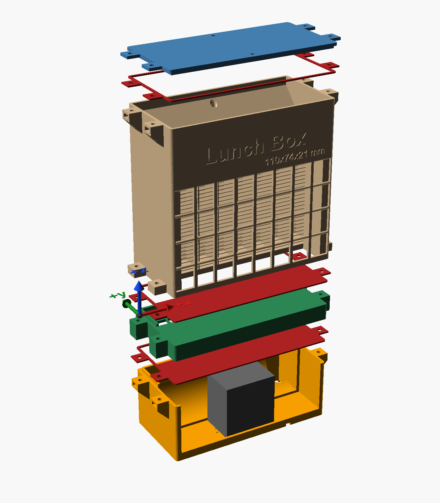
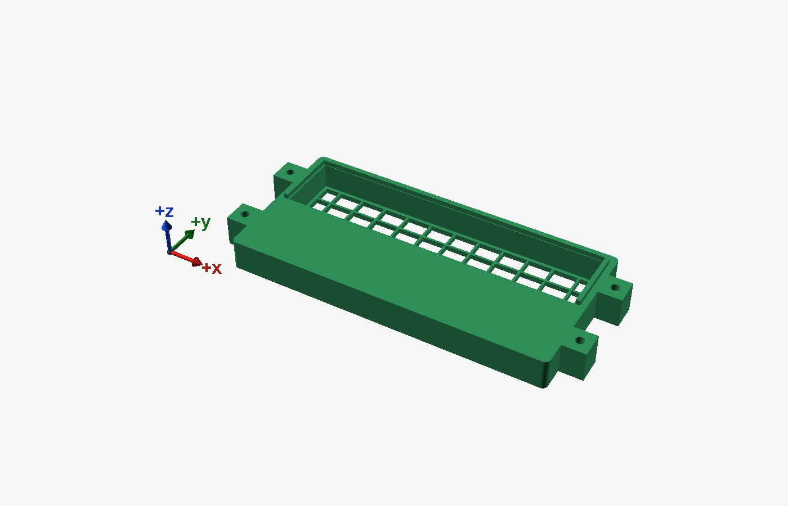
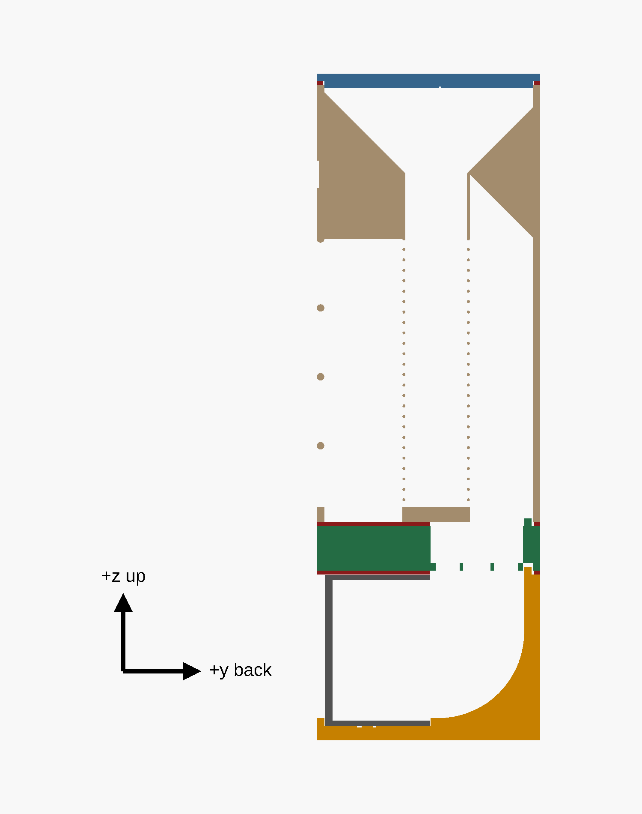
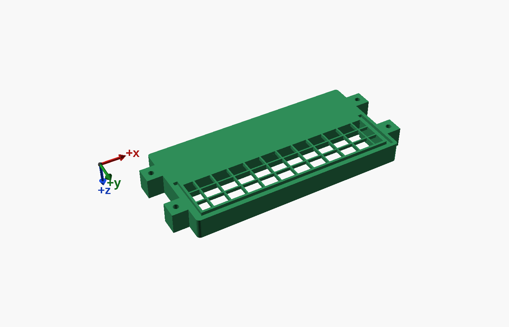
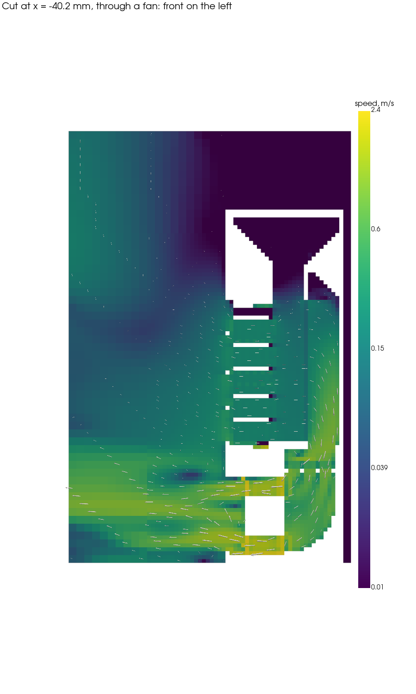
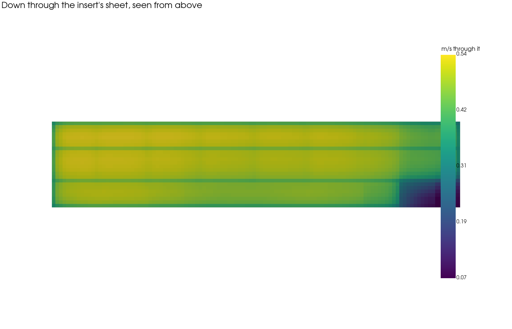
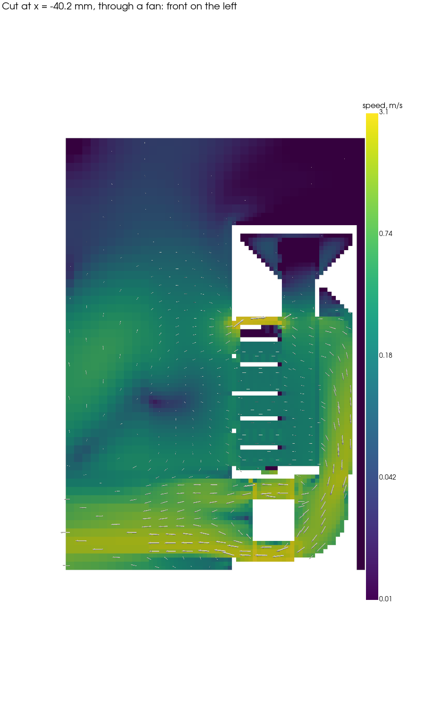
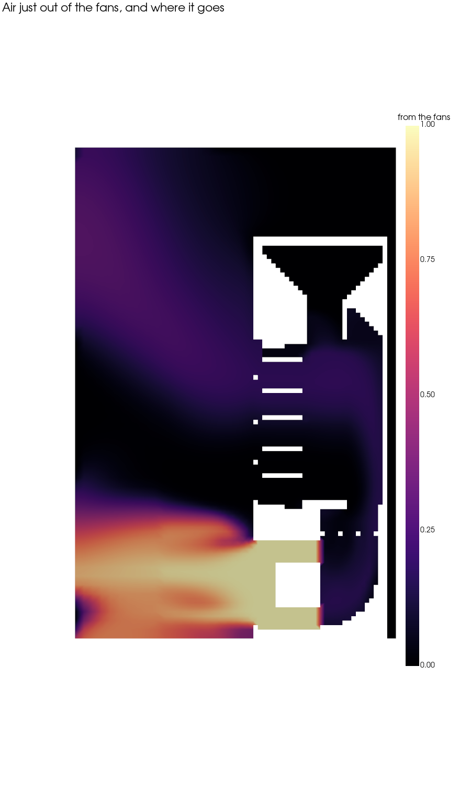
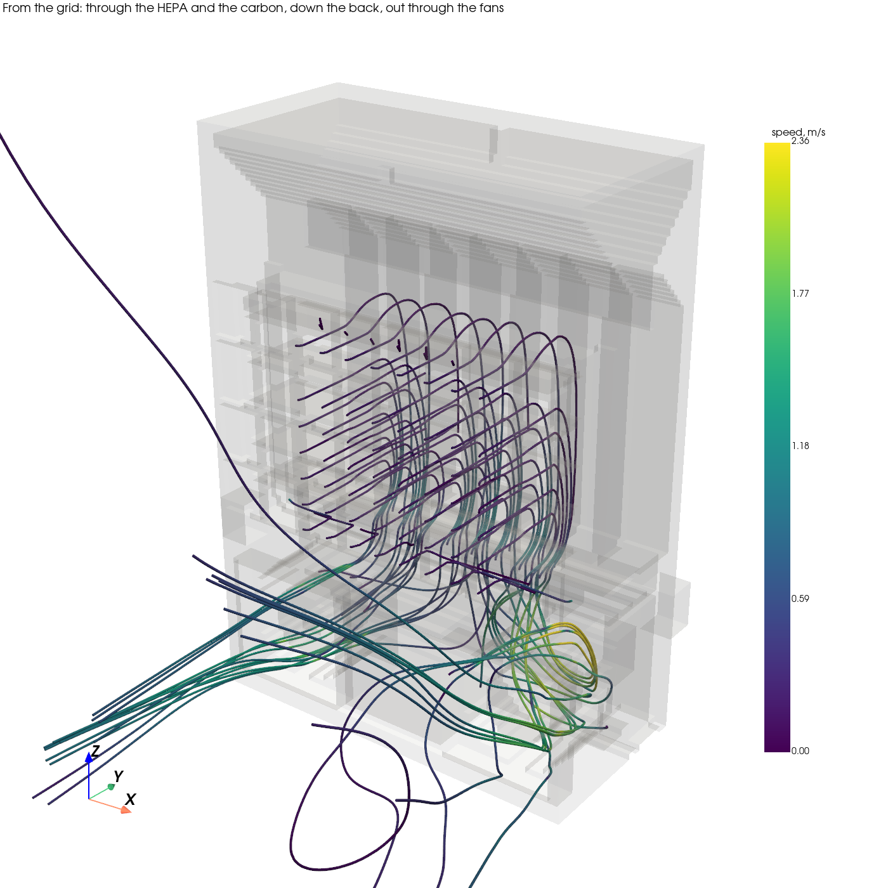

# The scrubber — LunchBox, remixed

The chamber's recirculating filter is GekoPrime's [LunchBox](https://www.printables.com/model/468166):
air comes in through the grid on the front, passes HEPA paper and a bed of carbon pellets, goes down a
channel at the back, and the fans underneath blow it out at the front. It takes three 40 mm fans; this
build runs two 40 × 40 × 20 mm Delta EFB0412VHD, 12 V, with a tach wire each.

The remix adds four things and leaves the originals as they are, apart from tabs:



| | What it does | File |
|---|---|---|
| **Insert** | A section between the body and the fan section, holding a flat filter sheet that stops carbon dust reaching the fans. Its top is the fan section's lip and its bottom the body's groove, so it drops into any LunchBox. | [`lunchbox-insert.scad`](../models/lunchbox/lunchbox-insert.scad), or [`lunchbox-insert-plain.scad`](../models/lunchbox/lunchbox-insert-plain.scad) without tabs |
| **Gaskets** | TPU. A ring for the lid. For each joint at the fans, a sheet that is solid under the HEPA paper and over the fans — the paper's bottom edge sits on it, and the fans get air only through the carbon — and open behind, where the air goes down. | [`lunchbox-gasket-lid.scad`](../models/lunchbox/lunchbox-gasket-lid.scad), [`lunchbox-gasket-fans.scad`](../models/lunchbox/lunchbox-gasket-fans.scad) |
| **Blank** | Closes the fan section's middle bay: two fans, one in each outer bay. | [`lunchbox-blank.scad`](../models/lunchbox/lunchbox-blank.scad) |
| **Tabs** | Two on each short end of the fan joint, clamped by an M3 screw into a nut that slides into a slot. Added to the original body and fan section. The lid needs none: its own two screws clamp its gasket. | [`lunchbox-body.scad`](../models/lunchbox/lunchbox-body.scad), [`lunchbox-fans.scad`](../models/lunchbox/lunchbox-fans.scad) |

**Not printed yet.** Every fit is checked against the original's STLs (see *Checking it*), not yet
against printed parts.

## The insert



The front of it is solid: it takes the place of what held the HEPA paper and the fans down. The back is
open, under the body's channel. The sheet lies on a grid at the bottom of that cavity, with 5 mm of air
above it, so the air coming down the 14 mm channel spreads forward over the whole sheet: 28 cm² of filter,
where the channel's own opening is 16 cm².



**The sheet:** polyester filter floss, about 5 mm thick loose, cut to **115 × 25 mm** — a little over the
cavity, so it seals at its edges. It is there for carbon dust, which is coarse; it needs to be open, not
fine. Flat HEPA paper would be the wrong thing here: unpleated, it would choke the fans. Change the sheet
when it turns grey.



## Printing

Every part's file draws it in the pose it prints in. No supports, no brim: the tabs that face down while
printing stand on a 45° support of their own, and the nut slots' roofs are short bridges.

| Part | Material | Count | Time | Filament |
|---|---|---|---|---|
| Insert | ASA | 1 | 2 h 24 m | 26 g |
| Gasket, fans | TPU 95A | 2 with the insert, 1 without | 1 h 2 m | 6 g |
| Gasket, lid | TPU 95A | 1 | 8 m | 1 g |
| Blank | ASA | 1 | 1 h 6 m | 9 g |
| Body, with tabs | ASA | 1 | 13 h 19 m | 126 g |
| Fan section, with tabs | ASA | 1 | 4 h 13 m | 45 g |

Times and weights are PrusaSlicer's, at 0.2 mm with the house profile `0.2mm QUALITY @MK3 - no skirt, no
brim, no crossing perimeter`, as [`scad-check.sh`](https://github.com/AlonRR/scad-tools) slices them.
Print the lid, `filter_lid_110x74x21.stl`, and the HEPA frame, `furnace_filter.stl`, as they come.

## Hardware

| Quantity | Item |
|---|---|
| 4 | M3 × 30 socket head cap screw — the fan joint, through the insert |
| 4 | M3 hex nut, ISO 4032 |
| 2 | M3 × 20 screw — the lid's own two, into the body's 3 mm holes |
| 2 | 40 × 40 × 20 mm 12 V fan |
| 1 | polyester filter floss, 115 × 25 mm |

Without the insert, the fan joint takes M3 × 16 instead. The lid's screws go 9–12 mm into the body's
bosses through the lid and its gasket; the holes are at least 12.5 mm deep.

## Putting it together

1. **Fan section:** a fan in each outer bay, blowing out of the front, and the blank in the middle bay,
   its closed face at the front. The wires leave by the opening in the floor's back right corner, as you
   face the front, which runs out under the end wall. Slide a nut into each of its four tabs.
2. **A fans gasket** on its rim, the ears over the tabs.
3. **The insert,** lip up, and the sheet on its grid.
4. **The second fans gasket** on the insert.
5. **The body,** with the HEPA paper in its frame pushed up into the holder from below. Screw the stack
   together with the four M3 × 30, down through the body's tabs and the insert into the nuts.
6. **Carbon** in from the top, through the funnel.
7. **The lid:** its gasket on the rim, the lid, and its two M3 × 20.

## The air through it

An airflow simulation of the whole stack, with the chamber's air in front of it: OpenFOAM, the two
Deltas on their published curve, the filters as resistances. How it is built and every assumption in it:
[`sim/lunchbox-cfd/`](../sim/lunchbox-cfd/README.md). The HEPA paper's grade is not known, and it sets the
flow more than anything else: the numbers are for a mid-grade paper.



| With the HEPA frame's top sealed (see below) | Without the insert | With the insert |
|---|---|---|
| Air through the HEPA paper | 1.39 L/s | 1.27 L/s |
| Air out through the fans | 1.77 L/s | 1.67 L/s |
| ...of it in at the wire hole, unfiltered | 0.36 L/s | 0.37 L/s |
| What the fans work against | 83 Pa | 84 Pa |

- **The insert costs about 9 % of the filtered air**: its sheet takes 10-13 Pa, against 65-75 Pa through
  the HEPA paper. At 1.27 L/s the scrubber filters a 180 L chamber's volume every 2.4 minutes.
- **All the air from the channel goes through the sheet**, evenly: 0.47 m/s on average, 0.54 at most, and
  nowhere below 0.07.

  
- **Checked on a finer mesh** (1 mm instead of 2, with the insert): the filtered air comes out within 2 % -
  1.33 L/s instead of 1.30. The wire hole's leak grows, 0.47 L/s instead of 0.37, as its 2 mm recess is
  better resolved: if anything, the table under-states it.

### Two leaks, both downstream of the filters

**The wire hole.** The fan section's floor has a hole for the fans' wires, in its back right corner, and a
recess under it, 2 mm deep, open to the end and the back. Standing on a flat floor, that recess is a duct
straight into the plenum, under every filter, with the fans pulling 84 Pa on it: **a fifth to a quarter of
the air the fans move comes in there, unfiltered.** Seal it round the wires - a plug of putty or tape - before
anything else.

**Over the HEPA frame.** The holder is 76.0 mm tall and the frame 73.4, so a 2.6 mm slot runs over the
paper, the whole width, straight into the carbon. Left open, the simulation sends **about half the air that
comes in at the grid through that slot instead of the paper** - an estimate, as the slot is barely wider
than the simulation's cells, but an orifice calculation agrees with it. Fill it: a strip on the frame's top.



### Where the air goes after the fans

The fans' jet runs out along the floor. Some of it curls back up to the grid: of the air the scrubber takes
in, 7 % with the insert and 24 % without has just come out of it. The two differ in the stack's height, and
the simulation's chamber is only a box of air in front, so take it as a sign, not a number: give the outlet
room to throw its air away from the box.





## Checking it

The model's rules are asserts and warnings in [`lunchbox.layout.scad`](../models/lunchbox/lunchbox.layout.scad).
The fits are checked against the original's STLs, which have to be in
[`models/lunchbox/original/`](../models/lunchbox/original/):

```sh
OPENSCAD="<the OpenSCAD nightly>" uv run scripts/lunchbox-checks.py all
```

It intersects every pair of parts that meet — the insert with the body, the insert with the fan section,
the blank with its bay, each gasket with what passes through it, the fan joint's tabs — and the air's
way through the insert and into the plenum. Each must come out empty. Every check has a positive control,
something broken on purpose that it must catch, and the run fails if one passes unnoticed. The body is
an 8 MB mesh, so it needs the nightly, whose Manifold backend does in seconds what the 2021.01 release
does in hours.

`scad-check.sh` builds the body with one warning: 56 edges with four faces on each, where the front grid's
bars meet the frame along a line. They are in the original's `filter_caddy_110x74x21.stl` as it comes, and
PrusaSlicer slices the body without repairing anything, so the remix leaves them.

It builds the fan section with two warnings, and these are the remix's own: the tops of its four tabs sit at
44.6 mm, as the remix computes them, against the original rim's 44.599998, as its STL stores it. Where the
two meet, 16 facets about two millionths of a millimetre tall result, and PrusaSlicer removes them as it loads
the part; the print is the same. They are known and left as they are.

[`lunchbox.params.scad`](../models/lunchbox/lunchbox.params.scad) holds the original's dimensions, measured
by sectioning its STLs, and every setting of the remix.

## Credit and licence

LunchBox is © GekoPrime, under [CC BY-SA 4.0](https://creativecommons.org/licenses/by-sa/4.0/). The remix
— the models in [`models/lunchbox/`](../models/lunchbox/) and the pictures in [`lunchbox/`](lunchbox/) — is
under CC BY-SA 4.0 too.
